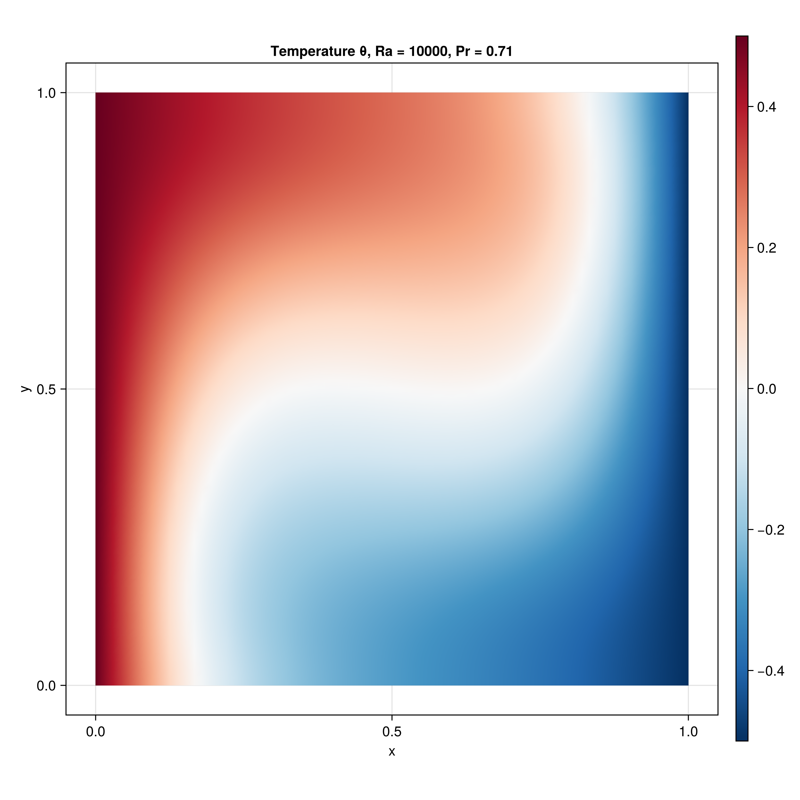
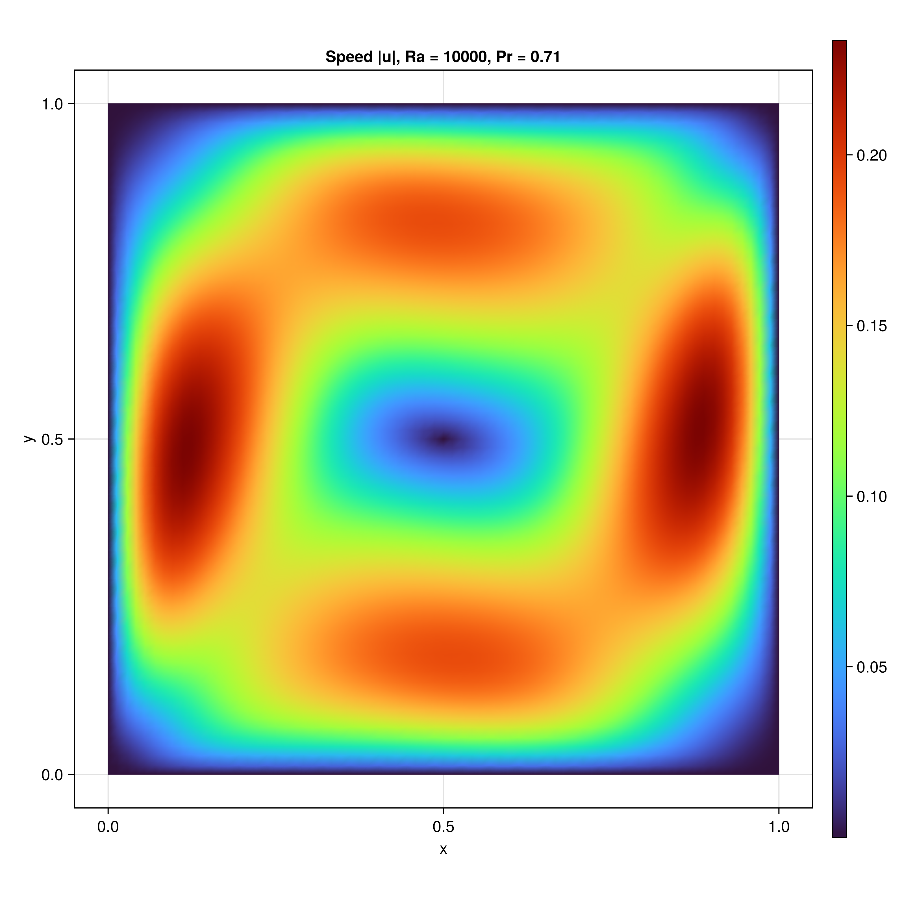

# TwoDG.jl

[](https://github.com/xkykai/TwoDG.jl/actions/workflows/CI.yml?query=branch%3Amain)
[](https://opensource.org/licenses/MIT)

A high-performance Julia framework for solving 2D partial differential equations using advanced finite element methods.

## Cool Visuals

<p align="center">
  
  <br>
  <em>Compressible flow through a channel with a bump computed with 2D Euler equations showing evolution of Mach number</em>
</p>

<p align="center">
  
  
  <br>
  <em>Pressure coefficient of a potential flow solution (left) and convection-diffusion solution on an unstructured mesh with Hybridizable Discontinuous Galerkin (HDG) (right)</em>
</p>

<p align="center">
  
  
  <br>
  <em>Natural convection in a differentially heated cavity at Ra = 10⁴ (incompressible nonhydrostatic Navier-Stokes equations with the Boussinesq approximation, HDG k = 3): temperature (left) and speed (right). The steady hot-wall Nusselt number matches the de Vahl Davis benchmark.</em>
</p>

<p align="center">
  
  <br>
  <em>Verification of the HDG incompressible Navier-Stokes solver with the Kovasznay flow at Re = 20: optimal k+1 convergence of velocity, pressure, and velocity gradient, and k+2 superconvergence of the exactly divergence-free, H(div)-conforming postprocessed velocity u*</em>
</p>


## Overview

TwoDG.jl provides a unified implementation of three powerful discretization schemes for 2D PDEs:

- **Continuous Galerkin (CG)** - Traditional continuous finite elements
- **Discontinuous Galerkin (DG)** - High-order explicit time-stepping methods
- **Hybridizable Discontinuous Galerkin (HDG)** - Efficient implicit solvers with static condensation and parallel capabilities

Whether you're studying wave propagation, compressible flows, or convection-diffusion phenomena, TwoDG.jl offers the numerical tools to tackle these problems with arbitrary polynomial orders and sophisticated error analysis.

## Key Features

- **Multiple PDE Types**: Poisson, convection-diffusion, wave equations, Euler equations, and the incompressible Navier-Stokes equations (with optional Boussinesq buoyancy)
- **High-Order Accuracy**: Arbitrary polynomial order support (p-refinement) with Koornwinder orthogonal basis
- **Efficient HDG**: Static condensation dramatically reduces system size compared to standard DG
- **Parallel HDG Solver**: Multi-threaded assembly and solving for large-scale problems
- **Rich Mesh Support**: Built-in generators for squares, circles, L-shapes, NACA airfoils, and more
- **Comprehensive Examples**: Convergence studies, wave scattering, channel flows, and transport problems
- **Performance Optimized**: Inline functions and careful pre-allocation for computational efficiency

## What Can You Do With It?

- **Run convergence studies** to verify optimal rates across different polynomial orders
- **Compare discretization methods** (CG vs DG vs HDG) on the same problems
- **Simulate wave scattering** on complex geometries with absorption boundaries
- **Solve compressible flow** problems including shock waves in channels
- **Solve incompressible flow** problems (steady or time-dependent Navier-Stokes, natural convection with the Boussinesq approximation) with the HDG method of Nguyen, Peraire & Cockburn (JCP, 2011)
- **Analyze convection-diffusion** transport with various stabilization parameters
- **Develop new numerical methods** using the extensible master element framework

## Quick Example

```julia
using TwoDG

# Generate a mesh for your domain
mesh = squaremesh_rsquare(1.0, 5)  # 1x1 square, 5 elements per side

# Solve a Poisson problem with HDG
# (Check out examples in src/Apps/ for complete scripts)
```

## Getting Started

Explore the example scripts in `src/Apps/` to see the solvers in action:
- `runhdg_poisson.jl` - Poisson equation convergence studies
- `runwavescattering.jl` - Wave scattering on circular domains
- `runeulerchannel.jl` - Compressible Euler equations with shocks
- `runconvection.jl` - Pure convection with DG explicit time-stepping
- `runhdg_ns_kovasznay.jl` - Steady incompressible Navier-Stokes verification (Kovasznay flow, optimal k+1 convergence)
- `runhdg_ns_boussinesq.jl` - Natural convection in a heated cavity (incompressible nonhydrostatic Navier-Stokes with the Boussinesq approximation, validated against the de Vahl Davis benchmark)

Perfect for researchers in numerical analysis, students learning finite element methods, or anyone needing a flexible high-order PDE solver in Julia.