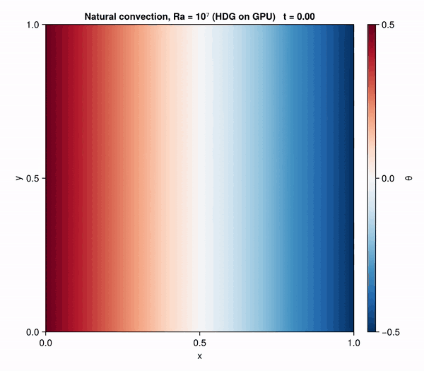
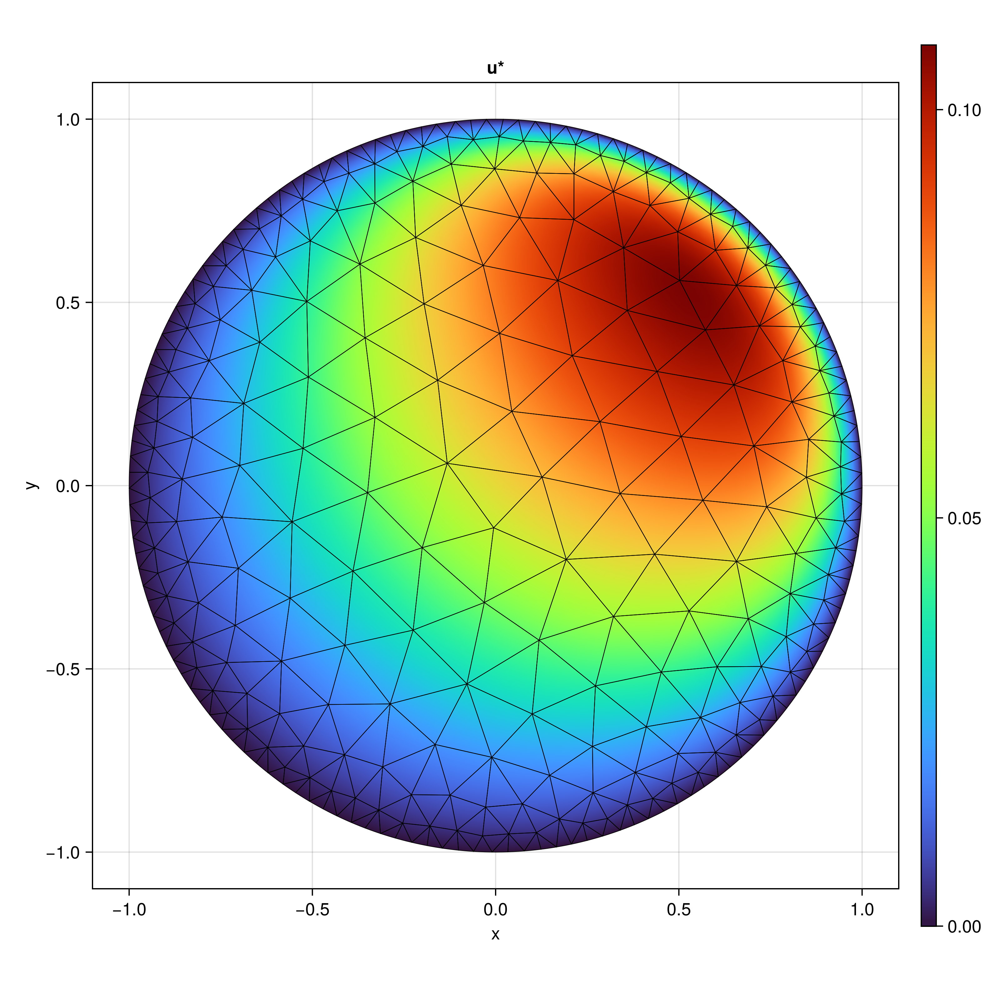
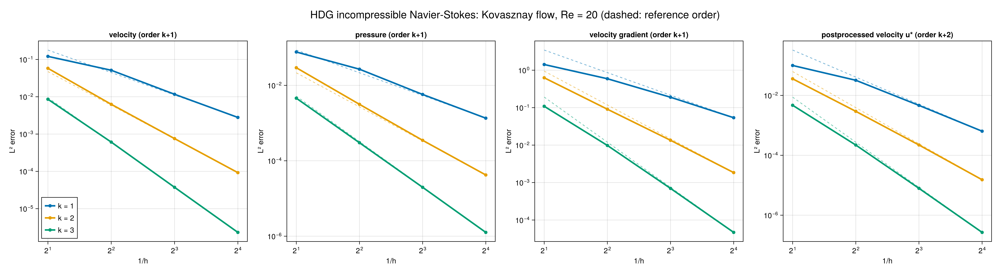

# TwoDG.jl

[](https://xkykai.github.io/TwoDG.jl/dev/)
[](https://github.com/xkykai/TwoDG.jl/actions/workflows/CI.yml?query=branch%3Amain)
[](https://codecov.io/gh/xkykai/TwoDG.jl)
[](https://opensource.org/licenses/MIT)

A high-performance Julia framework for solving 2D partial differential equations with high-order Galerkin methods — continuous, discontinuous, and hybridizable discontinuous — behind a single `solve` entry point, running on CPU or GPU from the same code.

## Why TwoDG?

- **Hybridizable DG (HDG) as a first-class solver.** Implicit high-order solves where the globally coupled unknowns live only on element faces: static condensation shrinks the system dramatically, the trace system is solved directly or with preconditioned Krylov iterations, and a cheap local postprocessing step recovers a solution that converges one order *faster* than the polynomial degree suggests (k+2 superconvergence). This extends all the way to steady and unsteady incompressible Navier–Stokes with an exactly divergence-free postprocessed velocity — capabilities usually confined to research codes.
- **GPU-resident implicit and explicit solvers.** Not just the explicit DG time loop: the batched HDG assembly and recovery and the matrix-free CG iteration also run through KernelAbstractions, so the same code executes on CPU threads or a CUDA GPU (`ArrayT = CuArray`), with no per-backend forks. The batched assembly path is orders of magnitude faster than element-by-element assembly even on the CPU.
- **High-order curved triangles.** Simplex elements with isoparametric curved boundaries at arbitrary polynomial order, so p-refinement on circles, airfoils, and mapped geometries keeps its design accuracy — no accuracy cliff at curved walls.
- **Three methods, one API.** CG, explicit (L)DG, and implicit HDG share the same meshes, equations, and boundary conditions, which makes head-to-head method comparison on the *same* problem a few lines of code — and makes the package a natural companion for a finite element methods course.
- **Numerics you can hand a precision or a stepper.** Element type is parametric (`T = Float32` runs the whole loop in single precision, on GPU too), and `semidiscretize` hands the semidiscrete system to the SciML ecosystem when you want adaptive or specialized time integrators instead of the built-in RK4.

## Installation

TwoDG is not yet registered; install it directly from GitHub:

```julia
julia> ]  # enter Pkg mode
pkg> add https://github.com/xkykai/TwoDG.jl
```

Julia 1.10 or newer is required. Plotting (`scaplot`, `meshplot`) activates when a Makie backend is loaded (`using CairoMakie`); GPU runs activate with `using CUDA` (or another KernelAbstractions backend); `semidiscretize` activates with SciMLBase/OrdinaryDiffEq; NACA meshes with `using Gmsh`.

## Cool Visuals

<p align="center">
  
  <br>
  <em>Compressible flow through a channel with a bump computed with 2D Euler equations showing evolution of Mach number</em>
</p>

<p align="center">
  
  <br>
  <em>Natural convection in a differentially heated cavity at Ra = 10⁷ (incompressible nonhydrostatic Navier-Stokes equations with the Boussinesq approximation), <strong>computed on the GPU</strong> with the implicit HDG solver (k = 3, wall-clustered curved elements): the batched element assembly, local solves, and recovery run on the device through KernelAbstractions. The hot-wall Nusselt number matches the Le Quéré benchmark.</em>
</p>

<p align="center">
  
  
  <br>
  <em>Pressure coefficient of a potential flow solution (left) and convection-diffusion solution on an unstructured mesh with Hybridizable Discontinuous Galerkin (HDG) (right)</em>
</p>

<p align="center">
  
  <br>
  <em>Verification of the HDG incompressible Navier-Stokes solver with the Kovasznay flow at Re = 20: optimal k+1 convergence of velocity, pressure, and velocity gradient, and k+2 superconvergence of the exactly divergence-free, H(div)-conforming postprocessed velocity u*</em>
</p>


## Supported Features

| | Equations | Time / solver | Backends |
|---|---|---|---|
| **DG / LDG** (explicit) | convection, convection-diffusion (LDG), first-order wave system, compressible Euler (Roe flux) | internal `RK4()`, or any OrdinaryDiffEq stepper via `semidiscretize` | CPU + GPU (whole time loop) |
| **HDG** (implicit, static condensation) | Poisson, steady convection-diffusion | `Direct()` sparse LU, `GMRES()` (Krylov.jl, block-Jacobi preconditioned, batched assembly) | `GMRES()`: CPU + GPU (assembly, Krylov solve, recovery); `Direct()`: CPU |
| **HDG Navier-Stokes** | steady/unsteady incompressible NS, Boussinesq buoyancy; superconvergent H(div) postprocessing | Newton + direct (driver-level API, see `examples/hdg/`); batched drivers (`hdg_ns_step_batched`, `hdg_cd_step_batched`) reuse the trace sparsity pattern and factorization across steps | CPU + GPU (batched assembly, local solves, recovery on device; condensed trace solve CPU) |
| **CG** | Poisson, convection-diffusion-reaction | `Direct()` sparse Cholesky/LU, `ConjugateGradient()` / `GMRES()` (matrix-free, Jacobi preconditioned) | `Direct()`: CPU; iterative: CPU + GPU |

GPU execution goes through KernelAbstractions: pass `ArrayT = CuArray` (with CUDA.jl loaded) and the DG time loop, the HDG batched local solves, condensed trace system (Krylov iterations included) and solution recovery, or the matrix-free CG iteration all run on the device. The sparse direct `Direct()` paths factorize on the CPU — that's inherent to sparse direct methods, not a limitation of the wrappers.

Meshes: structured square/L-shape, unstructured circle (distmesh), cos²-bump duct, Trefftz airfoil (conformal map), NACA 4-digit via Gmsh (package extension). All support curved isoparametric elements at arbitrary polynomial order (Koornwinder orthogonal basis); generators attach named boundary tags (`boundary_names(mesh)`). A `MeshGeometry` + `discretize(geo, porder)` two-stage API separates geometry from discretization.

Element type is parametric (`T = Float32` runs the whole DG loop in single precision, on GPU too). Postprocessing: `l2error`, HDG local postprocessing (`p+2` superconvergence), Makie plotting via extension.

## What Can You Do With It?

- **Run convergence studies** to verify optimal rates across different polynomial orders
- **Compare discretization methods** (CG vs DG vs HDG) on the same problems
- **Simulate wave scattering** on complex geometries with absorption boundaries
- **Solve compressible flow** problems including shock waves in channels
- **Solve incompressible flow** problems (steady or time-dependent Navier-Stokes, natural convection with the Boussinesq approximation) with the HDG method of Nguyen, Peraire & Cockburn (JCP, 2011)
- **Analyze convection-diffusion** transport with various stabilization parameters
- **Develop new numerical methods** using the extensible master element framework

## Quick Example

```julia
using TwoDG

# unit square, 8×8×2 elements of polynomial order 3
mesh = mkmesh_square(9, 9, 3, 0, 1)

# steady Poisson problem, -Δu = f, u = 0 on the boundary, solved with HDG
f(p) = 2π^2 .* sin.(π .* p[:, 1]) .* sin.(π .* p[:, 2])
prob = HDGProblem(PoissonEquation(), mesh; bc = Dirichlet(0.0), source = f)
sol  = solve(prob)                       # or solve(prob, Direct())

l2error(sol, (x, y) -> sin(π * x) * sin(π * y))   # ~1e-6

# plotting needs a Makie backend: `using CairoMakie`, then
# scaplot(mesh, sol.u[:, 1, :], show_mesh = true)
```

Time-dependent conservation laws use `DGProblem` + `RK4()`, with boundary
conditions by name and a CFL-based time step (`ArrayT = CuArray` runs the
whole loop on a GPU):

```julia
eq   = ConvectionDiffusionEquation([1.0, 0.5], 0.01)
prob = DGProblem(eq, mesh;
                 bc = (bottom = Dirichlet(), right = Neumann(),
                       top    = Dirichlet(), left  = Neumann()),
                 u0 = [(x, y) -> exp(-16 * ((x - 0.5)^2 + (y - 0.5)^2))])
sol  = solve(prob, RK4(); dt = compute_dt(prob), tfinal = 1.0)

# or hand the semidiscretization to OrdinaryDiffEq (needs SciMLBase loaded):
using OrdinaryDiffEqTsit5
ode = semidiscretize(prob, (0.0, 1.0))
sol = solve(ode, Tsit5())
```

## Getting Started

Explore the example scripts in `examples/` to see the solvers in action:
- `runhdg_poisson.jl` - Poisson equation convergence studies
- `runwavescattering.jl` - Wave scattering on circular domains
- `runeulerchannel.jl` - Compressible Euler equations with shocks
- `runconvection.jl` - Pure convection with DG explicit time-stepping
- `runhdg_ns_kovasznay.jl` - Steady incompressible Navier-Stokes verification (Kovasznay flow, optimal k+1 convergence)
- `runhdg_ns_boussinesq.jl` - Natural convection in a heated cavity (incompressible nonhydrostatic Navier-Stokes with the Boussinesq approximation, validated against the de Vahl Davis benchmark)
- `runhdg_ns_boussinesq_animation.jl` - The Ra = 10⁷ cavity animation from the gallery above, run with the GPU-accelerated batched HDG solvers (`hdg_ns_step_batched`/`hdg_cd_step_batched`)

Perfect for researchers in numerical analysis, students learning finite element methods, or anyone needing a flexible high-order PDE solver in Julia.